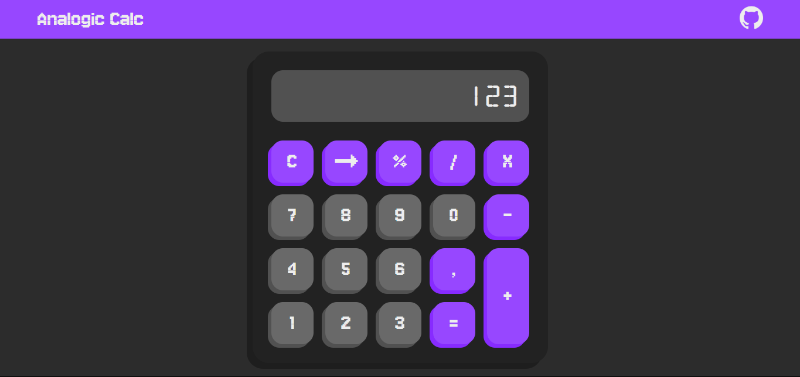
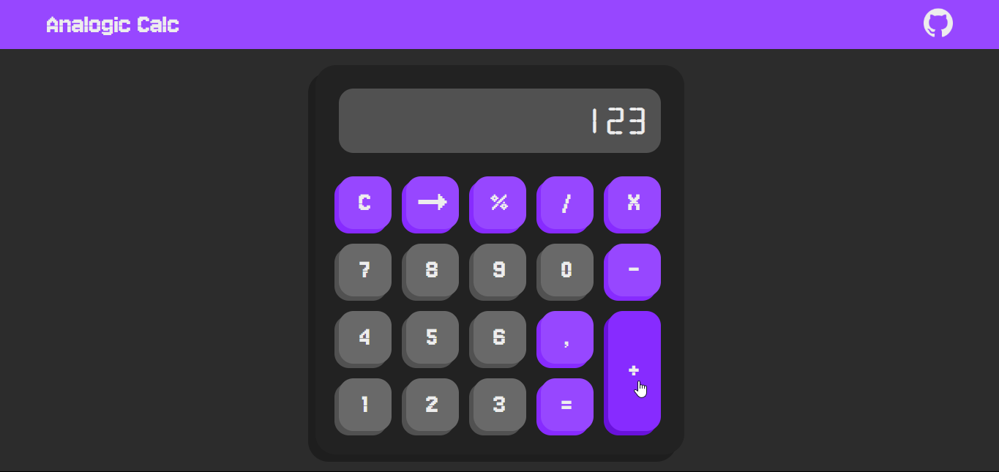
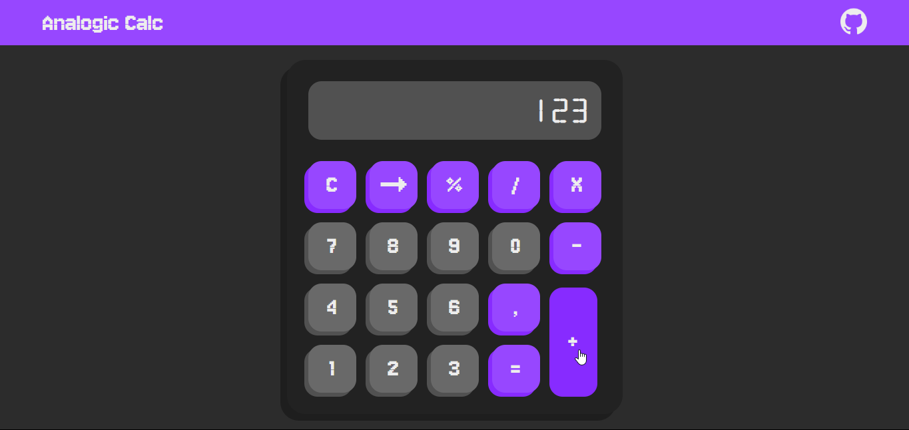

# Analogic Calc 🧮
  Analogic Calc é uma calculadora básica desenvolvida para realizar operações matemáticas simples de forma intuitiva e eficiente. Este projeto é ideal para quem precisa de uma ferramenta prática para cálculos do dia a dia.

## Tecnologias Usasdas  🚀
  - HTML: Estruturação do conteúdo da página.
  - CSS: Estilização e design responsivo.
  - JavaScript: Lógica de funcionamento da calculadora.
  - Figma: Prototipagem e design da interface.

## Funcionalidades 🔢
  - Adicionar Números: Insira os números que deseja calcular.
  - Adicionar Operadores: Suporte para operações básicas (+, -, *, /).
  - Porcentagem: Calcule porcentagens rapidamente.
  - Limpar Tela: Redefina a calculadora para um novo cálculo.
  - Apagar Último Caractere: Remova o último número ou operador inserido.
  - Resultado da Conta: Mostre o resultado da operação realizada.

## Como Usar 💻
  1. Insira os números e operadores desejados.
  2. Utilize as funcionalidades para manipular os dados conforme necessário.
  3. Clique em "=" para ver o cálculo final.

## Imagens

## Link de Hospedagem 🌐
  Acesse a calculadora online: analogic-calc.vercel.app

## Contribuição 🤝
  Contribuições são bem-vindas! Sinta-se à vontade para abrir issues ou pull requests para melhorias e novas funcionalidades.

## Link de Hospedagem 🌐
  Acesse a calculadora online: [Vercel](https://analogic-calc.vercel.app/)
